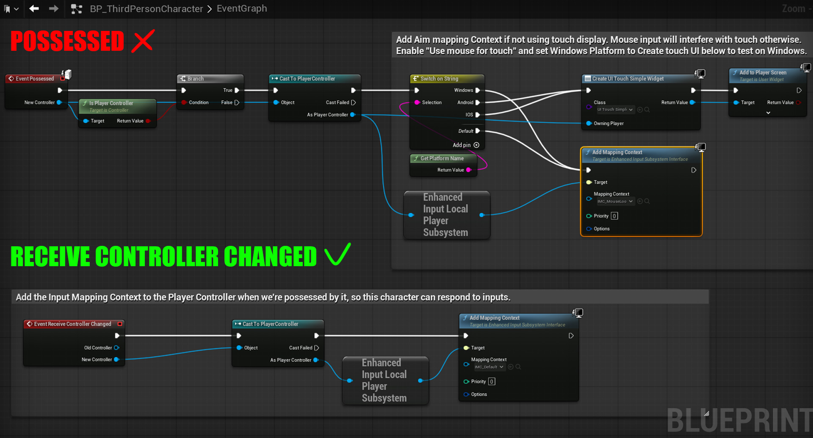

# How to fix `"Accessed None"` for Enhanced Input on Listen Server in Unreal Engine 5.6

Do you run the **Third Person Template**, and suddenly your mouse stops working?  
Your character probably **can walk with WASD and jump**, but you **can’t look around with the mouse**.  
You see errors like:  
```
Blueprint Runtime Error: Accessed None trying to read Local Player Subsystem
```
Your Unreal Engine version is **5.6**?  
Epic still hasn’t patched this?  
Then this quick fix is for you!

---

## What the bug looks like?
If you’ve ever tried to run the default Third Person Template as a **Listen Server** (Play in Editor with multiple clients) in **Unreal Engine 5.6**, you probably noticed that the mouse input stops working, and you get this error.


In **Standalone**, it works fine — but not with Listen Server!


---

## Why this happens

The default template adds the **Input Mapping Context** in the `Possessed` event.
On a **Listen Server**, the `Possessed` event runs **on the server first**, but the server has **no Local Player Subsystem**.
Meanwhile, on the client side, the `Pawn` might receive `Possess` **before the `PlayerController` is fully replicated**, so **Enhanced Input** fails to initialize properly.
Here’s how it looks by default in the **Third Person Character**:



---

### **Note about UE 5.6**

In **UE 5.6**, you may see **new Mapping Contexts**:  
- One context for keyboard input  
- Another specifically for mouse look

Previously, the single context was usually added in `BeginPlay` — which mostly worked, but only for simple **automatic Pawn spawn**.  
Now, with multiple contexts and `Possessed` + `Receive Controller Changed` mixed together — the Listen Server breaks this flow.

---

## *The Fix

- **Move** the `Add Mapping Context` node to the **`Receive Controller Changed`** event instead of `Possessed`.  
- **Always wrap** it with **`Is Locally Controlled`** — so only the owning client sets up input.  
- **Call** `Set Input Mode Game Only` and `Show Mouse Cursor` if needed.

Your new setup should look like this:


This guarantees that your input is added **only for the local player**, and **only when the controller is fully ready** — fixing the broken input bug on Listen Server.


---

This repo contains a working minimal project with my fixed template — feel free to clone and test.

---

**Thanks for reading — I hope this little fix saves you time and nerves!**

Shared by the [https://www.silvercord-vr.com/](**SilverCord-VR** team} — we believe Unreal knowledge should be open & clear.  
If you found this helpful, let’s stay in touch — we love collaborating on ambitious **multiplayer/VR** projects!
